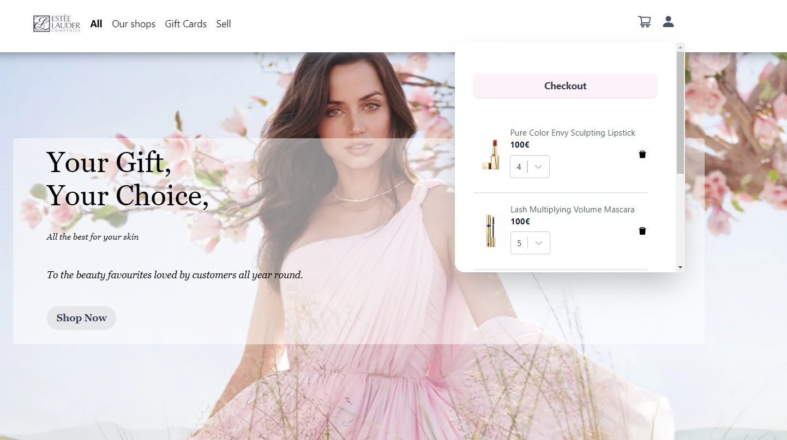
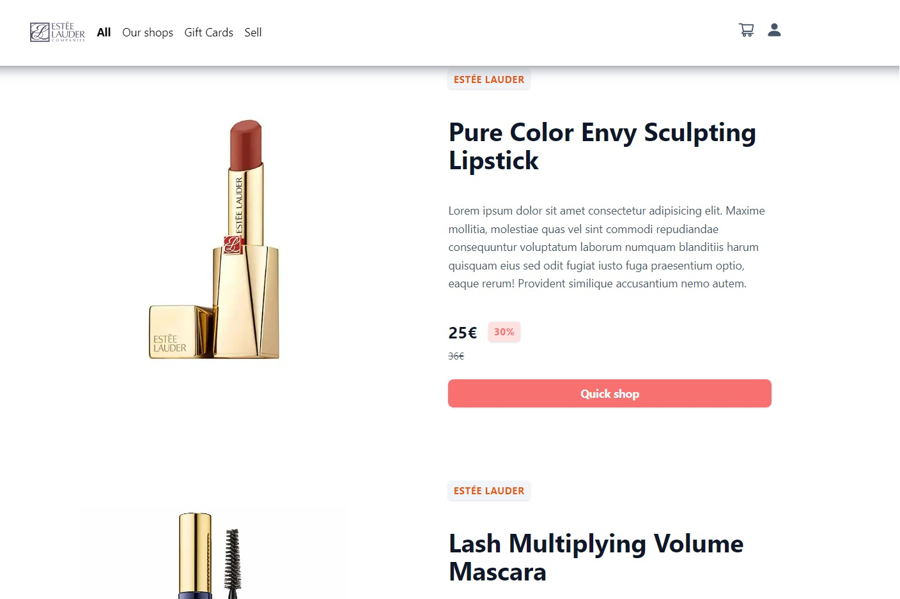
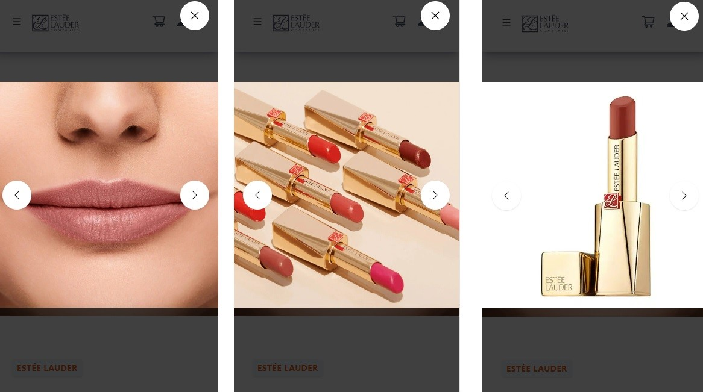

# Built with NextJS, Strapi and Tailwind

## Overview ##









## How To Use

To clone and run this application, you'll need Git and Node.js (which comes with npm) installed on your computer. From your command line:
```
# Clone this repository
$ git clone https://github.com/your-user-name/your-project-name

# Install dependencies both in back and front folders
$ npm install

# Run the app in front folder:
$ npm run dev

# ... and back folder (cd laurent_strapi):
$ npm run develop


```

Open [http://localhost:3000](http://localhost:3000) with your browser to see the result.

You can start editing the page by modifying `pages/index.js`. The page auto-updates as you edit the file.

[API routes](https://nextjs.org/docs/api-routes/introduction) can be accessed on [http://localhost:3000/api/hello](http://localhost:3000/api/hello). This endpoint can be edited in `pages/api/hello.js`.

The `pages/api` directory is mapped to `/api/*`. Files in this directory are treated as [API routes](https://nextjs.org/docs/api-routes/introduction) instead of React pages.


